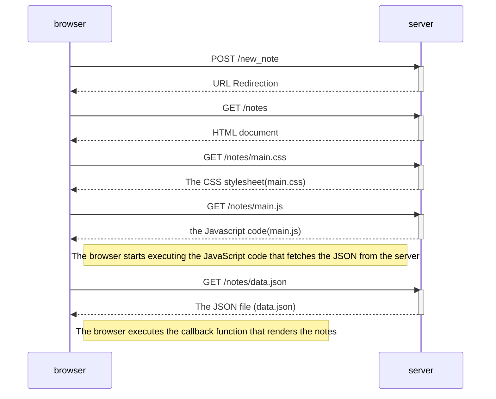

```mermaid

sequenceDiagram
participant browser
participant server

browser->>server: POST /new_note
activate server
server-->>browser: URL Redirection
deactivate server

browser->>server: GET /notes
activate server
server-->>browser: HTML document
deactivate server

browser->>server: GET /notes/main.css
activate server
server-->>browser: The CSS stylesheet(main.css)
deactivate server


browser->>server: GET /notes/main.js
activate server
server-->>browser: the Javascript code(main.js)
deactivate server

Note right of browser: The browser starts executing the JavaScript code that fetches the JSON from the server

browser->>server: GET /notes/data.json
activate server
server-->>browser: The JSON file (data.json)
deactivate server

Note right of browser: The browser executes the callback function that renders the notes

```
